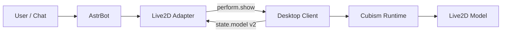

# Architecture

## Desktop Client

The desktop client owns rendering, model import, model positioning, media playback, desktop screenshots, recording, and local model alias configuration.

## AstrBot Adapter

The adapter owns WebSocket serving, authentication, AstrBot message conversion, resource references, planner follow-up sequences, and protocol compatibility.

## Model Alias Flow

1. Desktop scans the loaded model.
2. Desktop builds or loads per-model alias configuration.
3. Desktop sends `state.model` with v2 `motions` and `expressions`.
4. Adapter converts semantic or custom planner output into `perform.show` elements.
5. Desktop resolves `motion.name` and `expression.name` back to concrete model runtime IDs.
