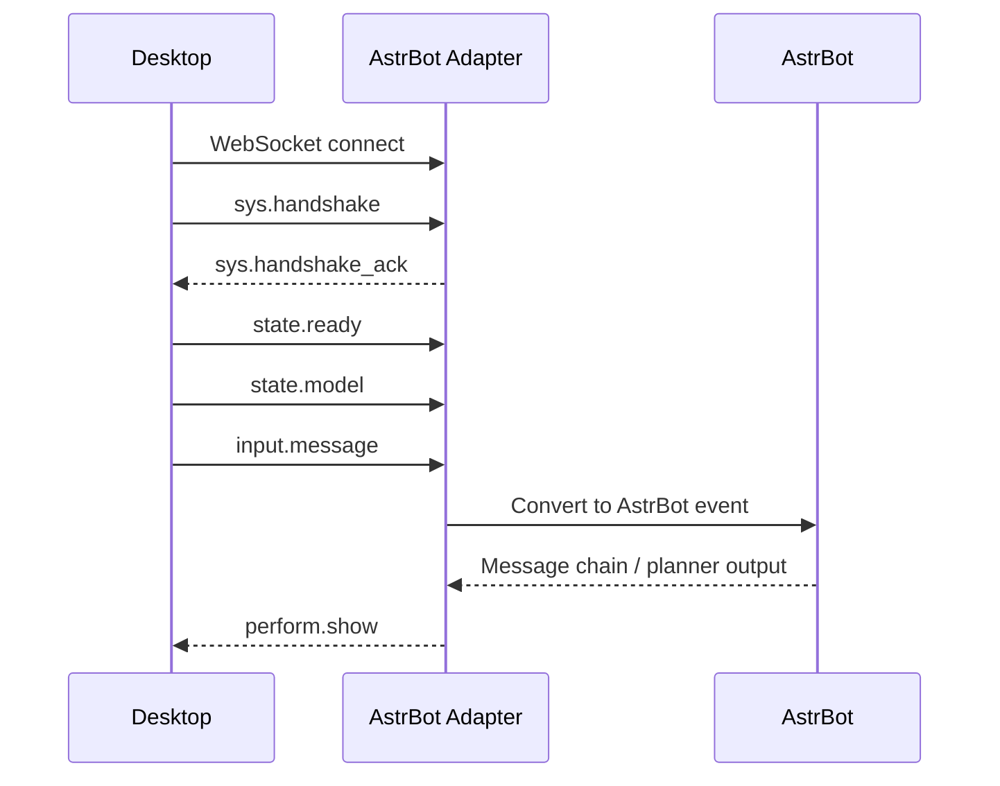

# Protocol Overview

L2D-Bridge Protocol is the WebSocket JSON protocol between the desktop client and the AstrBot Live2D adapter. The protocol version is `1.0.0`; v2 alias support is a compatible extension on top of `state.model` and `perform.show`.

## Packet Envelope

All messages use the same outer envelope:

```json
{
  "op": "perform.show",
  "id": "uuid",
  "ts": 1781240000000,
  "payload": {}
}
```

| Field | Type | Required | Description |
| --- | --- | --- | --- |
| `op` | string | yes | Operation code, such as `sys.handshake` or `perform.show`. |
| `id` | string | yes | Message ID, usually a UUID. Request-response operations must reuse the same `id`. |
| `ts` | number | yes | Unix timestamp in milliseconds. |
| `payload` | object | no | Operation-specific payload. |
| `error` | object | no | Error object, usually used by `sys.error` or failed request responses. |

## Lifecycle



## Layers

| Layer | Operation codes | Direction | Description |
| --- | --- | --- | --- |
| System | `sys.handshake`, `sys.handshake_ack`, `sys.ping`, `sys.pong`, `sys.error` | both | Connection, auth, heartbeat, and errors. |
| Input | `input.message`, `input.touch`, `input.shortcut` | desktop -> adapter | User messages, touches, and shortcuts. |
| Perform | `perform.show`, `perform.interrupt` | adapter -> desktop | Text, media, motion, expression, and interruption control. |
| State | `state.ready`, `state.playing`, `state.config`, `state.model` | desktop -> adapter | Desktop state and model capability reporting. |
| Resource | `resource.prepare`, `resource.commit`, `resource.get`, `resource.release`, `resource.progress` | both | Large-file references, uploads, and releases. |
| Desktop RPC | `desktop.window.list`, `desktop.window.active`, `desktop.capture.screenshot`, `desktop.tool.call` | adapter -> desktop request | Window list, active window, screenshots, and tool calls. |

## Reference Map

| Page | Use it for |
| --- | --- |
| [Connection](./connection.md) | WebSocket URL, token, handshake payload, heartbeat, and session config. |
| [Input Events](./input-events.md) | `input.message` message chains, touch events, and shortcuts. |
| [State Model v2](./state-model-v2.md) | Model capability reports, motion/expression aliases, and v1 compatibility fields. |
| [Perform Show](./perform-show.md) | Performance sequences, element types, and v1/v2 motion/expression forms. |
| [Resources](./resources.md) | `url` / `rid` / `inline` resource references and upload flow. |
| [Desktop RPC](./desktop-rpc.md) | Window list, active window, screenshot, and desktop tool responses. |
| [Errors](./errors.md) | `sys.error` shape and error codes. |

## Compatibility

The v2 alias extension does not replace v1 packets. It adds richer `state.model` fields and lets `perform.show` use readable `name` values:

- v1 motion: `{ "type": "motion", "group": "TapBody", "index": 0 }`
- v2 motion: `{ "type": "motion", "name": "触摸身体1" }`
- v1 expression: `{ "type": "expression", "id": "Smile" }`
- v2 expression: `{ "type": "expression", "name": "微笑" }`

The adapter should continue accepting v1 `motionGroups` and `expressions: string[]`. The desktop client sends `version: "2.0"` alias payloads by default after v1.5.0, while the protocol major version remains `1.0.0`.
