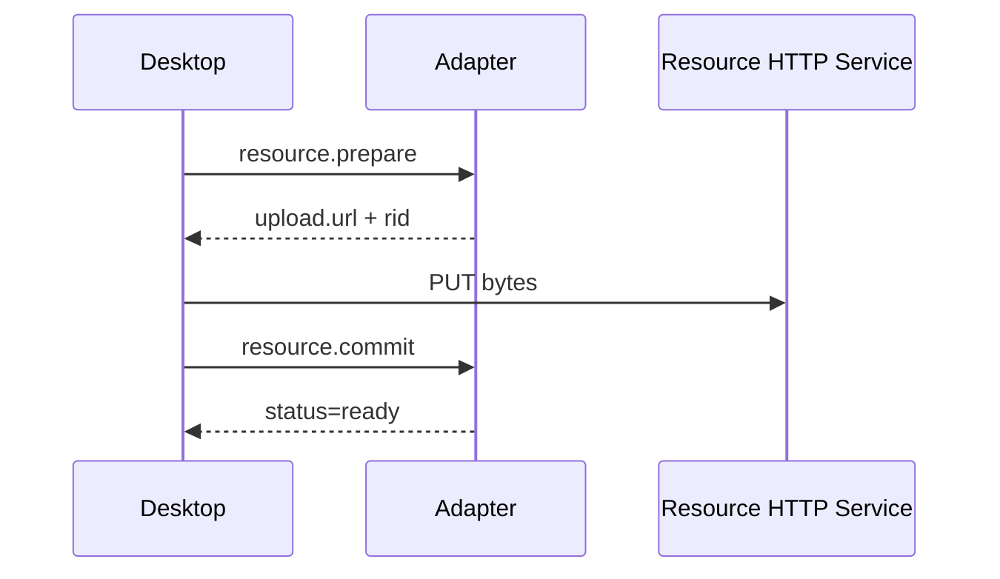

# Resources

The resource protocol handles images, audio, video, and files. Small resources may be embedded in WebSocket messages; large resources should use the HTTP resource service.

## Reference Forms

Performance elements and input messages can use three resource reference forms:

```json
{ "url": "https://example.com/image.png" }
```

```json
{ "rid": "resource-uuid" }
```

```json
{ "inline": "data:image/png;base64,iVBORw0KG..." }
```

| Form | Best for | Description |
| --- | --- | --- |
| `url` | Existing HTTP(S) resources or adapter resource URLs | The desktop loads it directly. |
| `rid` | Files uploaded to the resource service | Resolve through `resource.get` or handshake resource config. |
| `inline` | Small files or debugging data | Increases WebSocket message size. Keep it under `handshake_ack.config.maxInlineBytes`. |

## Upload Flow



## `resource.prepare`

| Item | Value |
| --- | --- |
| Direction | desktop -> adapter |
| Trigger | Client is about to upload a large resource |
| Response | Same `op` and same `id` |

Request:

```json
{
  "op": "resource.prepare",
  "id": "resource-prepare-id",
  "ts": 1781240000000,
  "payload": {
    "kind": "image",
    "mime": "image/png",
    "size": 1024000,
    "sha256": "abc123..."
  }
}
```

Response:

```json
{
  "op": "resource.prepare",
  "id": "resource-prepare-id",
  "ts": 1781240000100,
  "payload": {
    "rid": "resource-uuid",
    "upload": {
      "method": "PUT",
      "url": "http://127.0.0.1:9090/resources/resource-uuid",
      "headers": {
        "Authorization": "Bearer token"
      }
    },
    "resource": {
      "rid": "resource-uuid",
      "url": "http://127.0.0.1:9090/resources/resource-uuid",
      "kind": "image",
      "mime": "image/png",
      "size": 1024000,
      "sha256": "abc123...",
      "status": "pending"
    }
  }
}
```

| Field | Type | Required | Description |
| --- | --- | --- | --- |
| `kind` | string | yes | `image`, `audio`, `video`, `file`, and similar values. |
| `mime` | string | yes | MIME type. Fallback may be `application/octet-stream`. |
| `size` | number | yes | Byte size. |
| `sha256` | string | no | Content hash for diagnostics or deduplication. |

## `resource.commit`

After HTTP PUT completes, the client confirms the resource with `resource.commit`.

```json
{
  "op": "resource.commit",
  "id": "resource-commit-id",
  "ts": 1781240000000,
  "payload": {
    "rid": "resource-uuid",
    "size": 1024000
  }
}
```

```json
{
  "op": "resource.commit",
  "id": "resource-commit-id",
  "ts": 1781240000100,
  "payload": {
    "rid": "resource-uuid",
    "status": "ready"
  }
}
```

## `resource.get`

Look up an accessible URL and metadata by resource ID.

```json
{
  "op": "resource.get",
  "id": "resource-get-id",
  "ts": 1781240000000,
  "payload": {
    "rid": "resource-uuid"
  }
}
```

Response payload is a resource object:

```json
{
  "rid": "resource-uuid",
  "url": "http://127.0.0.1:9090/resources/resource-uuid",
  "kind": "image",
  "mime": "image/png",
  "size": 1024000,
  "sha256": "abc123...",
  "status": "ready"
}
```

## `resource.release`

Release a resource that is no longer needed.

```json
{
  "op": "resource.release",
  "id": "resource-release-id",
  "ts": 1781240000000,
  "payload": {
    "rid": "resource-uuid"
  }
}
```

```json
{
  "op": "resource.release",
  "id": "resource-release-id",
  "ts": 1781240000100,
  "payload": {
    "rid": "resource-uuid",
    "released": true
  }
}
```

## `resource.progress`

Resource progress is a notification. The current adapter records it and does not require a response.

```json
{
  "op": "resource.progress",
  "id": "resource-progress-id",
  "ts": 1781240000000,
  "payload": {
    "rid": "resource-uuid",
    "loaded": 512000,
    "total": 1024000,
    "percent": 50
  }
}
```

## URL Resolution

The desktop client first uses the user-configured resource URL. If none is configured, it uses `sys.handshake_ack.config.resourceBaseUrl` and `resourcePath`. If the handshake does not provide them, it derives the HTTP base URL from the WebSocket URL and defaults to `/resources`.

::: warning
Do not send local `file://` paths directly to the other side. When the adapter needs to output local files, it should copy them into the resource directory and reference them by resource URL or `rid`.
:::
