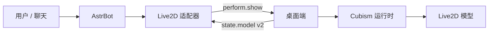

# 架构

## 桌面端

桌面端负责渲染、模型导入、模型定位、媒体播放、桌面截图、录制，以及本地模型别名配置。

## AstrBot 适配器

适配器负责 WebSocket 服务、认证、AstrBot 消息转换、资源引用、规划器后续序列，以及协议兼容。

## 模型别名流程

1. 桌面端扫描当前加载的模型。
2. 桌面端生成或读取该模型的别名配置。
3. 桌面端通过 `state.model` 发送 v2 `motions` 与 `expressions`。
4. 适配器将语义动作或自定义规划器输出转换为 `perform.show` 元素。
5. 桌面端把 `motion.name` 和 `expression.name` 解析回具体的模型运行时 ID。
