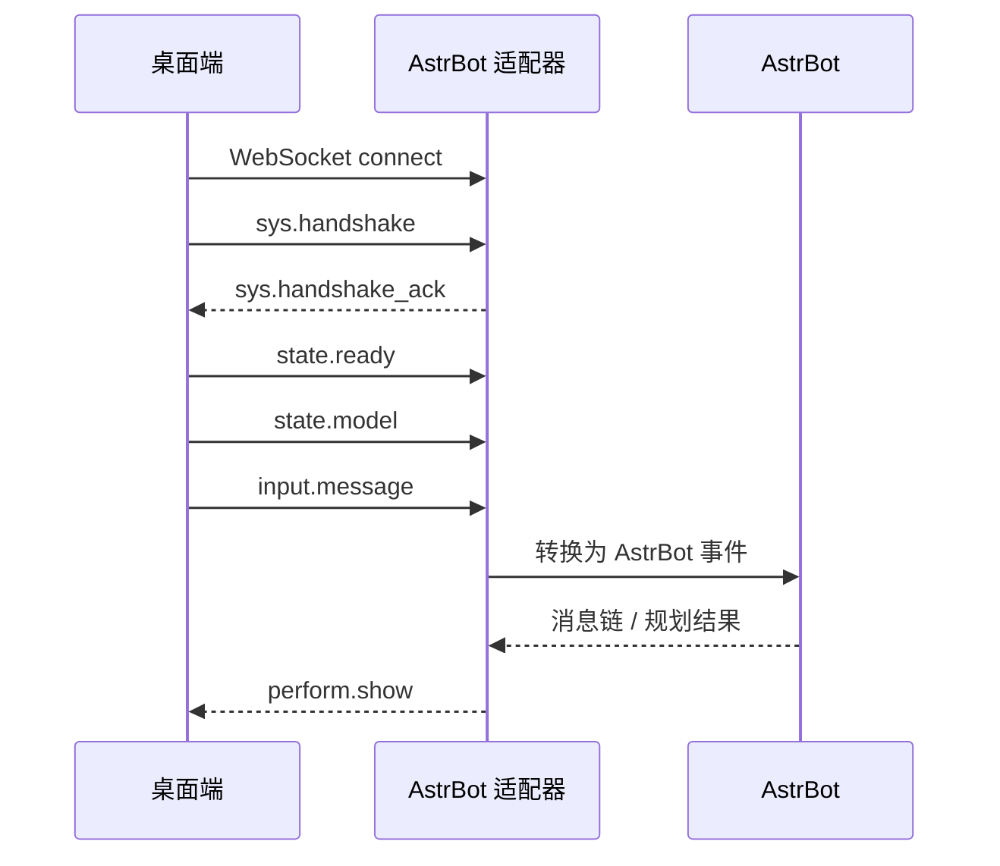

# 协议总览

L2D-Bridge Protocol 是桌面端和 AstrBot Live2D 适配器之间的 WebSocket JSON 协议。协议版本为 `1.0.0`，v2 别名能力作为兼容扩展附加在 `state.model` 和 `perform.show` 上。

## 数据包 Envelope

所有消息都使用同一个外层结构：

```json
{
  "op": "perform.show",
  "id": "uuid",
  "ts": 1781240000000,
  "payload": {}
}
```

| 字段 | 类型 | 必填 | 说明 |
| --- | --- | --- | --- |
| `op` | string | 是 | 操作码，如 `sys.handshake`、`perform.show`。 |
| `id` | string | 是 | 消息 ID，通常为 UUID。请求-响应型操作必须复用同一个 `id`。 |
| `ts` | number | 是 | Unix 毫秒时间戳。 |
| `payload` | object | 否 | 业务载荷。不同 `op` 的结构不同。 |
| `error` | object | 否 | 错误对象，通常只出现在 `sys.error` 或请求响应失败时。 |

## 生命周期



## 分层

| 分层 | 操作码 | 方向 | 说明 |
| --- | --- | --- | --- |
| System | `sys.handshake`, `sys.handshake_ack`, `sys.ping`, `sys.pong`, `sys.error` | 双向 | 连接、认证、心跳和错误。 |
| Input | `input.message`, `input.touch`, `input.shortcut` | 桌面端 -> 适配器 | 用户输入、触摸和快捷键。 |
| Perform | `perform.show`, `perform.interrupt` | 适配器 -> 桌面端 | 文本、媒体、动作、表情和中断控制。 |
| State | `state.ready`, `state.playing`, `state.config`, `state.model` | 桌面端 -> 适配器 | 桌面端状态和模型能力。 |
| Resource | `resource.prepare`, `resource.commit`, `resource.get`, `resource.release`, `resource.progress` | 双向 | 大文件资源引用、上传和释放。 |
| Desktop RPC | `desktop.window.list`, `desktop.window.active`, `desktop.capture.screenshot`, `desktop.tool.call` | 适配器 -> 桌面端请求 | 窗口列表、活跃窗口、截图和工具调用。 |

## 接口索引

| 页面 | 适合查什么 |
| --- | --- |
| [连接与握手](./connection.md) | WebSocket 地址、token、握手 payload、心跳和会话配置。 |
| [输入事件](./input-events.md) | `input.message` 内容链、触摸事件、快捷键事件。 |
| [State Model v2](./state-model-v2.md) | 模型能力上报、动作/表情别名、v1 兼容字段。 |
| [Perform Show](./perform-show.md) | 表演序列、元素类型、动作/表情 v1/v2 写法。 |
| [资源协议](./resources.md) | `url` / `rid` / `inline` 三种资源引用方式和上传流程。 |
| [桌面感知 RPC](./desktop-rpc.md) | 窗口列表、活跃窗口、截图和桌面工具响应。 |
| [错误码](./errors.md) | `sys.error` 结构和错误码含义。 |

## 兼容性

v2 别名扩展不会替代 v1 包。它会为 `state.model` 增加更丰富的字段，并允许 `perform.show` 使用可读的 `name` 值：

- v1 动作：`{ "type": "motion", "group": "TapBody", "index": 0 }`
- v2 动作：`{ "type": "motion", "name": "触摸身体1" }`
- v1 表情：`{ "type": "expression", "id": "Smile" }`
- v2 表情：`{ "type": "expression", "name": "微笑" }`

适配器应该继续接受 v1 `motionGroups` 与 `expressions: string[]`。桌面端在 v1.5.0 之后默认发送 `version: "2.0"` 的别名 payload，但协议主版本仍保持 `1.0.0`。
