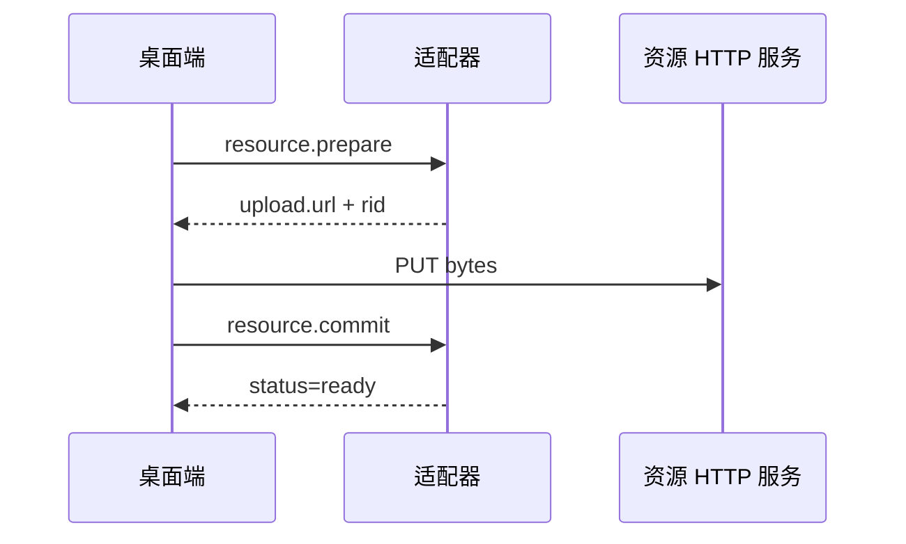

# 资源协议

资源协议用于处理图片、音频、视频和文件。小资源可以放在 WebSocket 消息内，大资源建议通过 HTTP 资源服务传输。

## 引用方式

表演元素和输入消息都可以使用以下三种资源引用：

```json
{ "url": "https://example.com/image.png" }
```

```json
{ "rid": "resource-uuid" }
```

```json
{ "inline": "data:image/png;base64,iVBORw0KG..." }
```

| 方式 | 适合场景 | 说明 |
| --- | --- | --- |
| `url` | 已有 HTTP(S) 资源或适配器资源 URL | 桌面端直接加载。 |
| `rid` | 已上传到资源服务的文件 | 需要通过 `resource.get` 或握手配置拼出 URL。 |
| `inline` | 小文件、调试数据 | 会增大 WebSocket 消息体。建议小于 `handshake_ack.config.maxInlineBytes`。 |

## 资源上传流程



## `resource.prepare`

| 项目 | 值 |
| --- | --- |
| 方向 | 桌面端 -> 适配器 |
| 触发时机 | 客户端准备上传大资源 |
| 响应 | 相同 `op` 和相同 `id` |

请求：

```json
{
  "op": "resource.prepare",
  "id": "resource-prepare-id",
  "ts": 1781240000000,
  "payload": {
    "kind": "image",
    "mime": "image/png",
    "size": 1024000,
    "sha256": "abc123..."
  }
}
```

响应：

```json
{
  "op": "resource.prepare",
  "id": "resource-prepare-id",
  "ts": 1781240000100,
  "payload": {
    "rid": "resource-uuid",
    "upload": {
      "method": "PUT",
      "url": "http://127.0.0.1:9090/resources/resource-uuid",
      "headers": {
        "Authorization": "Bearer token"
      }
    },
    "resource": {
      "rid": "resource-uuid",
      "url": "http://127.0.0.1:9090/resources/resource-uuid",
      "kind": "image",
      "mime": "image/png",
      "size": 1024000,
      "sha256": "abc123...",
      "status": "pending"
    }
  }
}
```

| 字段 | 类型 | 必填 | 说明 |
| --- | --- | --- | --- |
| `kind` | string | 是 | `image`、`audio`、`video`、`file` 等。 |
| `mime` | string | 是 | MIME 类型。默认可按 `application/octet-stream` 处理。 |
| `size` | number | 是 | 字节数。 |
| `sha256` | string | 否 | 内容哈希，用于诊断或去重。 |

## `resource.commit`

上传 HTTP PUT 完成后，客户端用 `resource.commit` 确认资源可用。

```json
{
  "op": "resource.commit",
  "id": "resource-commit-id",
  "ts": 1781240000000,
  "payload": {
    "rid": "resource-uuid",
    "size": 1024000
  }
}
```

```json
{
  "op": "resource.commit",
  "id": "resource-commit-id",
  "ts": 1781240000100,
  "payload": {
    "rid": "resource-uuid",
    "status": "ready"
  }
}
```

## `resource.get`

按资源 ID 查询可访问 URL 和元信息。

```json
{
  "op": "resource.get",
  "id": "resource-get-id",
  "ts": 1781240000000,
  "payload": {
    "rid": "resource-uuid"
  }
}
```

响应 payload 是资源对象：

```json
{
  "rid": "resource-uuid",
  "url": "http://127.0.0.1:9090/resources/resource-uuid",
  "kind": "image",
  "mime": "image/png",
  "size": 1024000,
  "sha256": "abc123...",
  "status": "ready"
}
```

## `resource.release`

释放不再需要的资源。

```json
{
  "op": "resource.release",
  "id": "resource-release-id",
  "ts": 1781240000000,
  "payload": {
    "rid": "resource-uuid"
  }
}
```

```json
{
  "op": "resource.release",
  "id": "resource-release-id",
  "ts": 1781240000100,
  "payload": {
    "rid": "resource-uuid",
    "released": true
  }
}
```

## `resource.progress`

资源进度是通知型消息，适配器当前记录日志，不要求响应。

```json
{
  "op": "resource.progress",
  "id": "resource-progress-id",
  "ts": 1781240000000,
  "payload": {
    "rid": "resource-uuid",
    "loaded": 512000,
    "total": 1024000,
    "percent": 50
  }
}
```

## 资源地址解析

桌面端优先使用用户配置的资源地址；未配置时使用 `sys.handshake_ack.config.resourceBaseUrl` 和 `resourcePath`。如果握手也没有提供，则从 WebSocket 地址推导 HTTP base URL，并默认使用 `/resources`。

::: warning
不要把本地 `file://` 路径直接下发给另一端。适配器输出侧遇到本地文件时应复制到资源目录，再通过资源 URL 或 `rid` 引用。
:::
